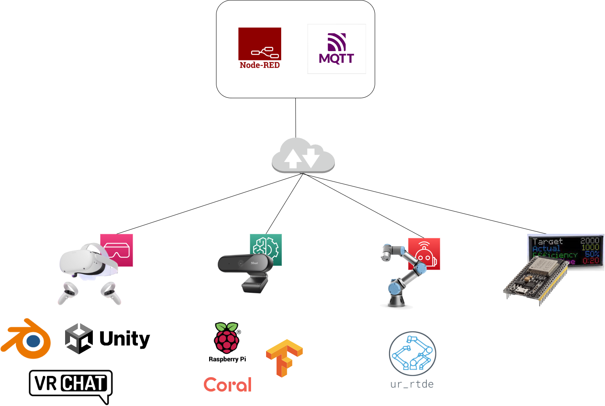
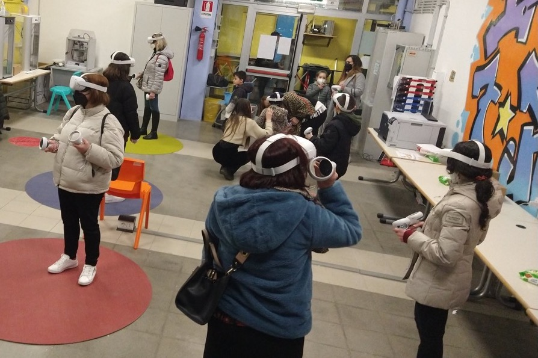

# Marconi Maker Faire Rome 2022

For this edition of the Maker Faire, the IIS Marconi Civitavecchia presents **"Project M.I.A.O."**.

Following a path undertaken in recent years, our school presents a new project to integrate virtual reality, social networks, artificial intelligence and robotics with each other. In fact, we think that the future of the "metaverse" will not be a parallel reality where we will have alternative lives, but an environment closely connected with our lives and the real world, for an "onlife" experience. With this in mind, we believe that schools are the right place to experiment, innovate and make students aware of what lies ahead.

The project includes the following components:
- the school garden reconstructed in virtual reality, navigable through the VRChat application, a virtual reality social platform; the garden will be accessible through Oculus Quest 2 headsets
- a Universal Robots UR3 robotic arm, with a webcam mounted on the arm, inside the garden; through artificial intelligence and chasing algorithms, the system will be able to recognize the cat and follow its movements within the garden; the cat will then also be materialized within the virtual garden
- another function of the UR3 arm will be to fill part of the cat's bowl, with a command that can come from either the physical or virtual world
- a "attendance-tracker" display in the real garden that makes one aware of the presence in the virtual world of meta-visitors at that moment

## Architecture

The webcam is connected to a Raspberry PI 4 or to a Google Coral, on which TensorFlow runs with the neural network model for cat recognition (object detection). The Raspberry sends the cat's position data to the MQTT broker, which will make them available to all interested subscribers.

The robotic arm is connected via LAN to the network and communicates with Node-RED through the proprietary RTDE protocol, of which there are libraries for both Node-RED and Python. For the "chasing" part, we will use specific open-source libraries for the purpose. For the filling part of the bowl, a program written by the students, which can be activated remotely, will start the filling procedure.

The attendance tracker display will be connected to an inexpensive and low energy consumption ESP32 board, in turn connected to the network via the school's WiFi. The ESP32 receives information from the MQTT broker on the number of people currently connected to the VR garden and displays them on the screen.

The Quest 2 virtual reality headset is also connected to WiFi and uses the VRChat app to connect to a world created specifically by students. The world is built with Blender for modeling and Unity for the integration with VRChat, the communication with the MQTT broker and the dynamic aspects of the world.

## Pictures
Miele, our mascotte (in the real world).

 

The UR3 robotics arm with the control unit on the left and the webcam on the right.

 

Our school's "makerspace" with Quest 2 in action.

 

The garden of our school reconstructed in virtual reality by our students.

<iframe src="https://drive.google.com/file/d/1CsIfhmmubFGT0FT8MzE9i3NcL0ogaM3_/preview" width="640" height="480" allow="autoplay"></iframe>

